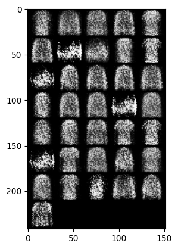
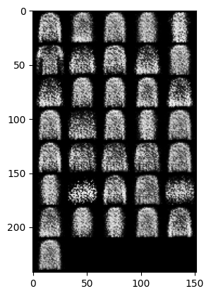
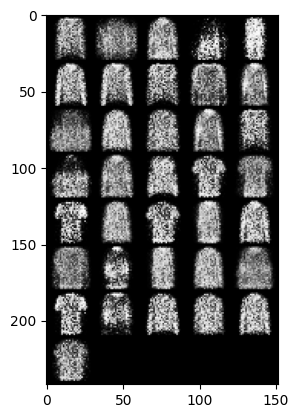
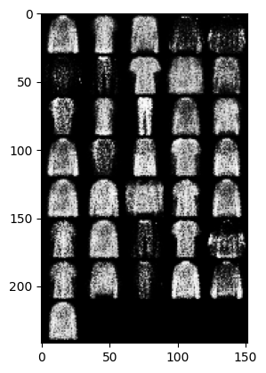
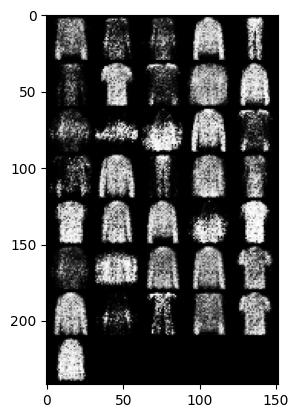
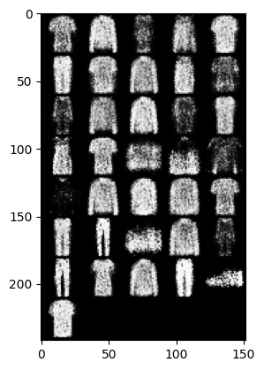
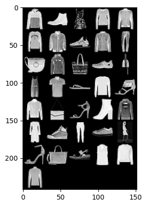

# Python Clothing Image Generator
Python Clothing Image Generator is a simple Python project that generates clothing images using GANs NN .It utilizes deep learning models and image synthesis algorithms to create gray clothing  items such as shirts, dresses, pants and more , I just wanted to show how a Generative Adversarial Networks works.

---

---

---

---

---

---

